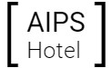

<p align="center">
  
</p>

## Description

Hotel AIPS is a students project for additional grade made with :heart:

## Installation

```bash
$ npm install
```

## Running the app

```bash
# development
$ npm run start

# watch mode
$ npm run start:dev

# production mode
$ npm run start:prod
```

## Test

```bash
# unit tests
$ npm run test

# e2e tests
$ npm run test:e2e

# test coverage
$ npm run test:cov
```

## Authors

- Maciej Siudak
- Dawid Marszałek
- Błażej Bąk
- Jan Bachman
- Aleksandra Popławska
- Dawid Pasieka

## License

hotelaipsapi is [MIT licensed](LICENSE).
